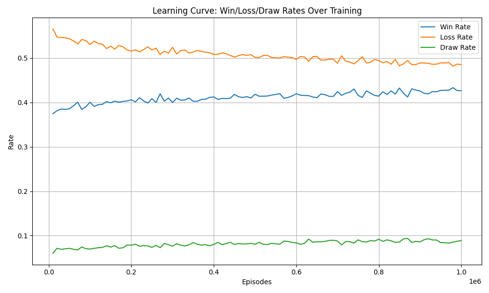
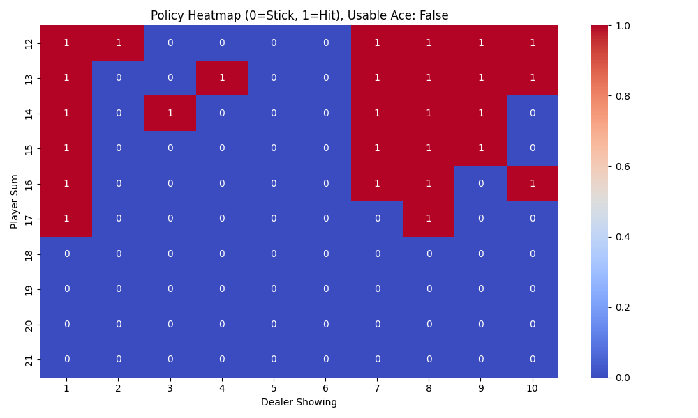
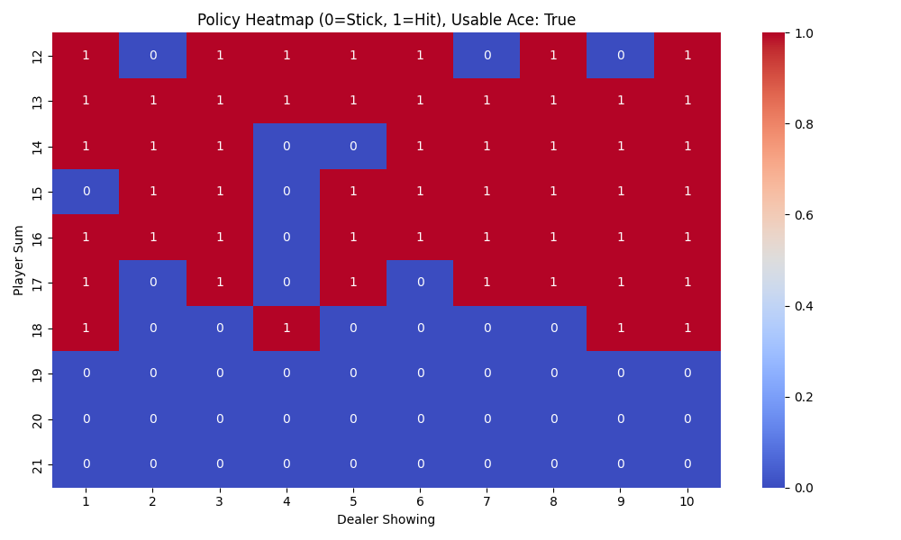

# AI Blackjack Game – Monte Carlo Reinforcement Learning


This project implements an AI agent that learns optimal blackjack strategies using Monte Carlo reinforcement learning. The environment mimics real casino conditions: the agent has only partial knowledge of the deck, faces realistic shuffling, and is limited in card counting ability. The agent is trained and evaluated using Python, NumPy, and OpenAI Gym.

---

## Visualizations

### Learning Curve

*Shows the agent’s win, loss, and draw rates over 1,000,000 training episodes. The win rate rises and stabilizes as the agent learns an optimal policy.*

### Policy Heatmaps
**No Usable Ace:**


**Usable Ace:**


*These heatmaps visualize the learned policy: for each player sum and dealer card, the color shows whether the agent prefers to hit (1) or stick (0). Patterns match human basic strategy, with more sticking at higher sums.*

---

## Project Description
- **Custom Environment:** The Blackjack environment is designed to be realistic, with partial deck knowledge, card counting limits, and casino-style shuffling. The agent does not have perfect information, making the challenge closer to real-world play.
- **Monte Carlo RL Agent:** The agent uses Monte Carlo policy evaluation and improvement to learn optimal strategies through simulated hands. Epsilon-greedy exploration with decay is used to balance exploration and exploitation.
- **Results:**
    - After 1,000,000 training episodes, the agent achieved:
        - **Wins:** 4,296 / 10,000 (42.96%)
        - **Losses:** 4,804 / 10,000 (48.04%)
        - **Draws:** 900 / 10,000 (9.0%)
    - This is close to the theoretical best for a player using basic strategy in a real casino, where the house edge is always present.

## Installation

### Prerequisites
- Python 3.10 (recommended for compatibility with NumPy and Gym)
- [git](https://git-scm.com/)

### Setup Steps

1. **Clone the repository:**
   ```bash
   git clone https://github.com/saadpy0/blackjack-montecarlo-rl.git
   cd blackjack-montecarlo-rl
   ```
2. **Create and activate a virtual environment:**
   ```bash
   python3.10 -m venv venv
   source venv/bin/activate
   ```
3. **Install dependencies:**
   ```bash
   pip install --upgrade pip
   pip install -r requirements.txt
   ```

## Usage

### Training the Agent
Run the training script to train the agent and save the Q-table:
```bash
python3.10 train.py
```

### Evaluating the Agent
After training, evaluate the agent's performance:
```bash
python3.10 evaluate.py
```

## Algorithm Explanation

### Monte Carlo Reinforcement Learning
- **Policy Evaluation:** The agent simulates many episodes of blackjack, recording the returns (rewards) for each state-action pair. The Q-value for each state-action is updated as the average return observed.
- **Policy Improvement:** The agent uses an epsilon-greedy policy: with probability epsilon, it explores (chooses a random action); otherwise, it exploits (chooses the best-known action). Epsilon decays over time to favor exploitation as learning progresses.
- **Epsilon Decay:** Epsilon starts at 0.2 and linearly decays to 0.01 over 1,000,000 episodes, allowing the agent to explore early and exploit later.
- **Partial Information:** The agent receives a noisy, limited card count as part of its observation, mimicking real-world constraints.

### Environment Details
- **Deck:** Multiple decks, shuffled with a penetration limit (reshuffle occurs after a certain fraction is dealt).
- **Observation:** Player sum, dealer's visible card, usable ace, and partial card count.
- **Actions:** Hit or stick.

## Results
After 1,000,000 training episodes:
- **Wins:** 4,296 / 10,000 (42.96%)
- **Losses:** 4,804 / 10,000 (48.04%)
- **Draws:** 900 / 10,000 (9.0%)

This performance is close to the best possible for a player in a real casino, given the house edge and realistic constraints.

## License
MIT 